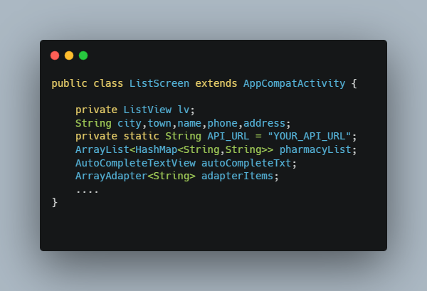

<!--
*** Semih Aydın 2023
-->

On-duty pharmacy mobile application.

# API
There are no API resources in the source files. You can use any API you want.
The application is in such a way that it can read JSON format. If the API you are going to use does not match the JSON format, you can change the code.

From [here](https://github.com/semihaydin0/PharmacyOnDuty/blob/main/app/src/main/java/com/example/nobetciezcaneuygulamasi/ListScreen.java#LL35C1-L35C1) you can go to the code block in the screenshot.

## In-App Images

## Made With
*   Java

## Contributing
Pull requests are welcome. For major changes, please open an issue first to discuss what you would like to change.

## Contact
For any problems, you can contact me at the addresses below.
*   Discord: PHOENIX#7103
*   E-Mail: semihaydn034@gmail.com

## License
[MIT](https://choosealicense.com/licenses/mit/)
